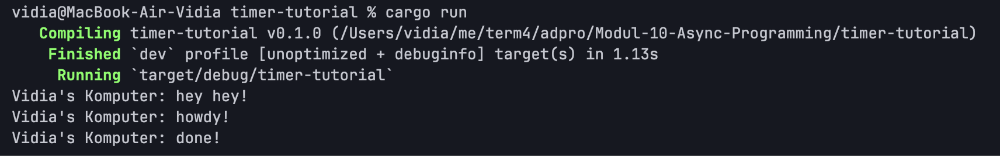

## Experiment 1.2: Understanding How It Works

"hey hey!" muncul pertama meskipun ditulis setelah `spawner.spawn(...)`.
Ini terjadi karena `spawn()` hanya mendaftarkan task ke antrian, belum
mengeksekusinya. Eksekusi baru terjadi saat `executor.run()` dipanggil.
Jadi urutan sebenarnya: spawn task -> cetak "hey hey!" -> drop -> executor
jalan -> "howdy!" -> tunggu 2 detik -> "done!".

## Experiment 1.3: Multiple Spawn and Removing Drop

### Multiple Spawn

Dengan 3 spawn, executor menjalankan ketiga task secara interleaved.
Semua "howdy" muncul duluan, lalu setelah timer selesai semua "done"
muncul. Satu thread bisa menangani banyak task tanpa membuat thread baru.

### Tanpa drop(spawner)

Program hang dan tidak selesai. `drop(spawner)` berfungsi sebagai sinyal
bahwa tidak ada task baru lagi. Tanpa itu, executor terus menunggu di
`recv()` selamanya karena channel masih terbuka.